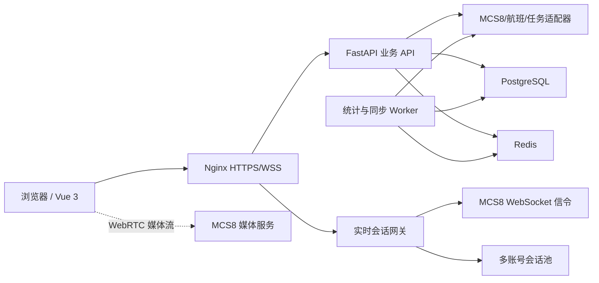

# CHA 航空监察平台成熟化改造方案

> 方案日期：2026-08-13
> 设计前提：可使用多个独立平台账号，不将账号互斥作为约束。
> 改造原则：保留现有数据来源和既有接口能力，采用兼容式扩展；先只读、后控制；先灰度、后替换；任何阶段均可快速回滚。

## 1. 现状判断

当前生产程序以单个 Python 文件承载 HTTP 服务、MCS8 接口适配、业务聚合、HTML、CSS 和 JavaScript，已经具备：

- 登录与会话；
- 设备、在线状态、设备目录和城市映射；
- 平台文件、设备文件和历史视频播放；
- GPS 定位及历史轨迹；
- 航班动态、例行任务和参考信息匹配；
- 监察记录；
- 多视频弹窗播放；
- 日间/夜间主题；
- 指挥调度和辅助查询标签页；
- 基础设备看板。

现状适合快速迭代，但不适合继续直接叠加实时视频、媒体会话、数据聚合、权限和审计。后续应将现有文件作为兼容基线，逐步拆分，而不是一次性重写。

## 2. 改造目标

### 2.1 产品目标

将 CHA 建设为四类工作场景统一的平台：

1. **态势总览**：一分钟内掌握设备、视频、航班、任务、告警和异常情况；
2. **实时指挥**：从设备树、地图或告警直接打开实时视频并进行多画面调度；
3. **事后监察**：高密度查询历史记录、关联航班和例行任务、形成监察记录；
4. **运行治理**：管理账号池、权限、接口健康、数据新鲜度、版本和审计。

### 2.2 技术目标

- 保持现有 `/api/*` 接口兼容；
- 新能力统一建设为 `/api/v2/*`；
- 实时媒体不经过 Python 视频转发，避免服务器成为带宽瓶颈；
- 账号和平台令牌仅由后端管理；
- 看板不在每次打开页面时全量扫描上游数据；
- 采用可回滚的版本目录和功能开关；
- 将账号、密码、密钥从源码迁出；
- 建立角色权限、操作审计和运行监控。

## 3. 目标信息架构

建议顶部一级导航调整为：

| 一级模块 | 核心内容 |
|---|---|
| 态势总览 | 综合看板、异常列表、地图态势、数据新鲜度 |
| 实时监控 | 多画面实时视频、设备树、地图选播、播放队列 |
| 视频记录 | 平台文件、设备文件、历史视频弹窗、参考信息 |
| 指挥调度 | 设备定位、历史轨迹、调度状态表 |
| 辅助查询 | 航班动态、例行任务、系统功能与版本 |
| 系统管理 | 用户角色、账号池、接口健康、审计日志、参数配置 |

普通用户可以不显示“系统管理”。原来的功能入口和接口继续保留，避免操作习惯和业务逻辑突然变化。

## 4. 页面设计

## 4.1 态势总览

### 全局筛选

- 时间：今天、近 3 天、近 7 天、近 30 天、自定义；
- 城市/机场；
- 设备组；
- 在线状态；
- 数据源；
- 自动刷新：关闭、15 秒、30 秒、60 秒。

筛选栏吸顶，默认不超过一行。每个指标必须显示统计周期和最后更新时间。

### 第一屏布局

第一行放置高优先级指标卡：

- 设备总数；
- 在线设备数和在线率；
- 当前实时视频路数；
- 今日视频数量；
- 今日视频总时长；
- 待处理异常；
- 航班视频覆盖率；
- 例行任务视频覆盖率。

第二行：

- 左侧：设备在线/离线和状态趋势；
- 中间：全国/机场地图，显示设备点位、状态和聚合；
- 右侧：待处理异常、长时间离线、上传延迟设备。

第三行：

- 视频数量及容量趋势；
- 图片/音频/视频类型分布；
- 城市或部门排名；
- 航班和任务关联情况。

第四行：

- 重点设备表；
- 无参考信息视频；
- 无视频覆盖航班/任务；
- 最近告警或监察事项。

### 下钻规则

- 点击“在线设备”进入已筛选的设备状态表；
- 点击地图点位弹出设备卡片，可打开实时视频、历史记录、轨迹；
- 点击“今日视频”进入对应时间范围的视频记录；
- 点击覆盖率进入未覆盖明细；
- 点击异常进入对应设备和处理页面。

### 指标口径

| 指标 | 定义 |
|---|---|
| 在线率 | 当前在线设备数 / 当前纳管设备数 |
| 今日视频数 | 拍摄时间落在今天的有效视频文件数 |
| 上传延迟 | 上传时间 - 拍摄结束时间 |
| 航班覆盖率 | 有匹配视频的应覆盖航班数 / 应覆盖航班数 |
| 任务覆盖率 | 有匹配视频的应执行任务数 / 应执行任务数 |
| 无参考信息视频 | 未匹配航班且未匹配例行任务的视频 |

## 4.2 实时监控

### 页面结构

- 左侧：设备树和搜索筛选；
- 中间：多画面播放区；
- 右侧：可折叠的播放队列、设备信息和事件信息；
- 顶部：画面布局、码流、声音、全屏、关闭全部和运行状态。

### 设备树

- 按城市、部门、设备组分层；
- 显示在线、离线、告警、正在播放状态；
- 支持设备编号、名称、城市、组名搜索；
- 支持“仅在线”“有视频能力”“最近使用”；
- 双击设备加入当前空闲窗口；
- 拖拽设备到指定播放窗口；
- 右键菜单提供实时视频、历史视频、定位、轨迹。

### 播放布局

支持 1、4、6、9、16、32 布局，但并发策略分级：

- 普通办公终端默认 1/4/9 路；
- 高性能终端允许 16 路；
- 32 路采用低码流、可见区域优先解码和自动降级；
- 用户切换布局时保留已打开设备和窗口顺序。

### 单窗口状态机

`空闲 → 正在分配账号 → 正在连接 → 正在协商媒体 → 播放中 → 重连中 → 失败/关闭`

每个状态必须有明确提示，不能长期只显示加载动画。失败时显示错误类别和建议操作。

### 单窗口工具栏

首版：

- 声音开关；
- 浏览器截图；
- 适应/填充；
- 单窗口全屏；
- 码流切换；
- 重新连接；
- 关闭。

后续受控开放：

- 语音对讲；
- 设备抓拍；
- 设备录像；
- 中心录像；
- 云台和焦距控制。

所有控制操作必须校验权限并记录审计。

### 实时视频与其他模块联动

- 地图设备卡片一键打开实时视频；
- 调度状态表一键打开实时视频；
- 异常或告警一键打开关联设备；
- 实时截图可以进入监察记录草稿；
- 实时画面可一键切换该设备的历史视频；
- 关闭实时画面时释放设备流、媒体组和账号占用。

## 4.3 视频记录

保留现有高密度表格和多视频弹窗设计，并增加：

- 保存查询条件；
- 常用筛选方案；
- 列显示和列宽持久化；
- 文件标题始终单行；
- 参考信息默认一行、按行或全部展开；
- 历史播放器和实时播放器使用统一窗口组件；
- 批量加入播放窗口；
- 查询结果导出；
- 从视频创建监察记录。

既有“高清播放、添加、复制文件名称”操作不变。

## 4.4 指挥调度

继续采用标签切换：

- 设备定位；
- 历史轨迹；
- 调度状态表。

调度状态表必须占满可用内容区，不与地图上下堆叠。新增“打开实时视频”只作为入口，不改变设备和定位接口。

## 4.5 辅助查询

继续采用左侧标签页：

- 航班动态；
- 例行任务；
- 系统功能与版本。

航班和任务详情增加“查看关联视频”“未覆盖原因”入口。版本记录从硬编码 HTML 调整为版本清单数据文件，随发布版本自动生成。

## 5. 目标技术架构



### 5.1 前端

建议：

- Vue 3；
- TypeScript；
- Vite；
- Pinia；
- Vue Router；
- Element Plus 或 Ant Design Vue；
- ECharts；
- Leaflet 或 MapLibre；
- 独立封装实时播放器组件。

现有内嵌 HTML 在过渡期继续运行，新页面按模块替换。不要一次性重写全部页面。

### 5.2 后端

建议将当前单文件逐步拆为：

```text
app/
  main.py
  api/
    auth.py
    dashboard.py
    devices.py
    records.py
    realtime.py
    flights.py
    routine.py
    inspections.py
  services/
    mcs8_auth.py
    mcs8_devices.py
    mcs8_records.py
    realtime_session.py
    account_pool.py
    dashboard_metrics.py
  adapters/
    mcs8.py
    flight.py
    routine.py
  models/
  repositories/
  workers/
  security/
```

推荐使用 FastAPI，但旧服务不立即删除。第一阶段可由 Nginx 将 `/api/v2/` 转发到新服务，其余路径仍由旧服务处理。

### 5.3 数据存储

PostgreSQL 只保存平台自己的派生数据和治理数据，不取代上游业务数据源：

- 用户、角色和权限；
- 上游账号配置；
- 登录和播放会话；
- 设备状态快照；
- 视频记录轻量索引；
- 小时/日指标桶；
- 告警和异常副本；
- 监察记录；
- 操作审计；
- 版本记录；
- 数据同步水位。

Redis 用于：

- 看板缓存；
- 短期会话；
- 分布式锁；
- 实时账号占用；
- 在线状态；
- 接口限流；
- 任务队列。

## 6. 多账号会话池

多个账号不直接下发给浏览器，而是由后端统一管理。

每个账号保存：

- 加密后的凭证引用；
- 当前登录状态；
- 最近成功登录时间；
- 令牌有效期；
- 当前占用用户和播放路数；
- 最大允许路数；
- 连续失败次数；
- 冷却时间；
- 健康状态。

分配策略：

1. 优先复用当前用户已分配且健康的账号；
2. 其次选择当前负载最低的健康账号；
3. 达到并发上限后切换其他账号；
4. 登录失败的账号进入熔断冷却；
5. 浏览器离开、超时或关闭全部画面后释放账号；
6. 后台定时检查并清理僵尸会话。

账号、密码和长期令牌不能写入前端、URL、浏览器存储或普通日志。

## 7. 实时视频接入方案

### 推荐路径

使用经过授权的 MCS8 JavaScript SDK和网关能力：

1. CHA 后端根据用户和设备分配上游账号；
2. 后端登录并创建短期实时会话；
3. 前端获得会话 ID、短期信令参数和允许的设备能力；
4. 前端播放器调用 SDK 打开设备视频；
5. 媒体流尽量由浏览器直连媒体服务；
6. CHA 后端记录开始、结束、设备、用户、账号、结果和错误；
7. 关闭窗口时主动关闭视频、离开媒体组并释放账号。

### 不推荐路径

- 让 Python 代理所有实时视频流；
- 把上游账号密码写入 JavaScript；
- 直接复制 AEE 的登录 Cookie；
- 长期依赖 AEE 页面内部接口；
- 所有 32 个窗口默认使用高清码流。

### 播放质量策略

- 单路或 4 路：默认高清；
- 6/9 路：默认标清，可手动切高清；
- 16/32 路：默认低码流；
- 浏览器 CPU、掉帧或带宽超过阈值时自动降码流；
- 非可见窗口可暂停解码但保持设备状态；
- 连续失败采用指数退避，避免频繁请求设备。

## 8. 新接口设计

### 8.1 看板

```text
GET /api/v2/dashboard/overview
GET /api/v2/dashboard/device-trend
GET /api/v2/dashboard/video-trend
GET /api/v2/dashboard/geography
GET /api/v2/dashboard/coverage
GET /api/v2/dashboard/exceptions
GET /api/v2/dashboard/freshness
```

所有接口使用统一筛选参数：

```text
from, to, city, group_id, device_id, status
```

### 8.2 实时视频

```text
POST   /api/v2/realtime/sessions
GET    /api/v2/realtime/sessions/{id}
POST   /api/v2/realtime/sessions/{id}/heartbeat
POST   /api/v2/realtime/sessions/{id}/streams
DELETE /api/v2/realtime/sessions/{id}/streams/{stream_id}
DELETE /api/v2/realtime/sessions/{id}
POST   /api/v2/realtime/sessions/{id}/snapshot
WS     /ws/v2/realtime/{session_id}
```

第二阶段控制接口：

```text
POST /api/v2/realtime/sessions/{id}/talk/start
POST /api/v2/realtime/sessions/{id}/talk/stop
POST /api/v2/realtime/sessions/{id}/record/start
POST /api/v2/realtime/sessions/{id}/record/stop
POST /api/v2/realtime/sessions/{id}/ptz
```

### 8.3 健康和治理

```text
GET /api/v2/health/upstreams
GET /api/v2/health/accounts
GET /api/v2/audit/events
GET /api/v2/system/releases
```

旧接口继续保留，前端逐页迁移到新接口。

## 9. 看板数据同步策略

避免用户每打开一次页面就全量扫描所有文件。

建议同步频率：

| 数据 | 建议频率 |
|---|---|
| 设备在线状态 | 10～15 秒 |
| 当前定位 | 15～30 秒 |
| 最新视频记录 | 30～60 秒增量同步 |
| 告警 | 15～30 秒 |
| 航班动态 | 1～5 分钟 |
| 例行任务 | 5 分钟 |
| 小时指标 | 每 5 分钟重算当前小时 |
| 历史日指标 | 每日校准一次 |

每个看板卡片显示数据新鲜度；某一数据源异常时，只将该指标标记为延迟，不阻塞整张看板。

## 10. 权限和安全

角色建议：

| 角色 | 权限 |
|---|---|
| 查看人员 | 看板、设备、历史视频、只读实时视频 |
| 调度人员 | 查看权限 + 多画面调度、截图 |
| 监察人员 | 查看权限 + 监察记录、关联业务信息 |
| 控制人员 | 对讲、录像、抓拍、云台等设备控制 |
| 系统管理员 | 用户、账号池、配置、审计和接口健康 |

安全要求：

- 凭证迁移到环境变量或专用密钥文件；
- 上游凭证加密存储；
- 登录 Cookie 使用 `HttpOnly`、`Secure`、`SameSite`；
- 写接口使用 CSRF 防护；
- 登录和控制接口限流；
- 配置 CSP、HSTS 和安全响应头；
- 日志过滤密码、令牌和签名 URL；
- 审计记录用户、时间、设备、动作、结果和来源 IP；
- 对讲、录像、云台操作采用更高权限和二次确认。

## 11. 兼容迁移策略

采用“绞杀者模式”，不是一次性替换：

1. 旧版继续处理现有页面和 `/api/*`；
2. 新后端只处理 `/api/v2/*` 和 `/ws/v2/*`；
3. 先上线新看板；
4. 再上线只读实时视频；
5. 视频记录等成熟模块逐页迁移；
6. 旧版达到稳定期后再移除内嵌页面。

功能开关：

```text
dashboard_v2
realtime_readonly
realtime_audio
realtime_control
account_pool_v2
records_v2
```

可按用户、角色或账号灰度开放。

## 12. 备份、发布和回滚

### 每阶段改造前备份

- `/opt/jdair-cha/releases`；
- `current` 软链接目标；
- 持久化 JSON 和监察记录；
- PostgreSQL 数据库；
- Redis 关键持久化文件（启用持久化时）；
- Nginx 配置；
- systemd 配置；
- 环境变量和密钥文件；
- 离线地图；
- 文件清单、权限和 SHA-256 校验文件。

完整备份不上传公共 GitHub；GitHub 仅保存脱敏代码、发布说明、备份元数据、校验值和恢复说明。

### 发布方式

继续使用：

```text
/opt/jdair-cha/releases/<timestamp>-<version>
/opt/jdair-cha/current -> 指向当前版本
```

新版本先部署到候选端口，完成健康检查和回归后再切换 Nginx 或软链接。

### 回滚

- 代码回滚：切回上一版本软链接；
- 数据库回滚：所有迁移必须向后兼容，禁止直接删除旧字段；
- 功能回滚：关闭对应功能开关；
- 实时视频回滚：关闭 `/realtime` 新入口，不影响历史视频和原业务页面。

## 13. 实施阶段

### 阶段 0：基线和治理

- 重新执行完整备份；
- 建立脱敏配置模板；
- 建立自动化回归；
- 固化接口响应样本；
- 增加功能开关；
- 建立版本、日志和健康检查。

### 阶段 1：工程拆分

- 新建 FastAPI `/api/v2` 服务；
- 抽离 MCS8、航班、任务适配器；
- 建立 PostgreSQL 和 Redis；
- 保持旧服务不变；
- Nginx 按路径分流。

### 阶段 2：态势看板

- 建立指标模型和同步 Worker；
- 完成总览、趋势、地图、异常和下钻；
- 支持自动刷新和数据新鲜度；
- 与设备、记录、航班、任务页面联动。

### 阶段 3：只读实时视频

- 接入多账号池；
- 接入 SDK、信令和媒体；
- 支持 1/4/6/9 布局；
- 支持声音、截图、全屏、关闭和重连；
- 建立播放质量和账号健康监控。

### 阶段 4：高并发和联动

- 增加 16/32 布局和自适应码流；
- 地图、调度表和异常直接打开实时视频；
- 实时截图进入监察流程；
- 实时与历史视频切换。

### 阶段 5：受控操作

- 对讲；
- 设备/中心录像；
- 设备抓拍；
- 云台控制；
- 权限、二次确认和审计。

### 阶段 6：旧页面逐步退役

- 视频记录迁移；
- 指挥调度迁移；
- 辅助查询迁移；
- 完成全链路压测和恢复演练；
- 下线旧内嵌前端，保留兼容接口一段观察期。

## 14. 验收标准

### 实时视频

- 单路首帧成功率不低于 98%；
- 首帧时间 P50 不高于 3 秒、P95 不高于 5 秒；
- 断线后 8 秒内完成自动恢复或给出明确失败原因；
- 9 路连续播放 2 小时无会话泄漏；
- 关闭窗口后设备流、媒体组和账号占用被释放；
- 账号、密码和长期令牌不出现在浏览器、URL 和普通日志；
- 不支持的视频能力不显示对应按钮；
- 16/32 路根据终端能力自动降码流。

### 看板

- 缓存命中时接口 P95 不高于 1 秒；
- 首屏加载不高于 2 秒；
- 卡片、图表和明细口径一致；
- 设备状态延迟不高于 30 秒；
- 视频记录正常情况下延迟不高于 2 分钟；
- 单一上游异常不影响其他模块；
- 所有主要图表支持下钻；
- 显示最后更新时间和数据异常提示。

### 发布

- 登录、设备列表、视频记录、历史播放、定位、轨迹、航班、任务和监察记录全部通过回归；
- 旧接口响应结构不变；
- 备份校验成功；
- 回滚演练成功；
- GitHub 发布记录和生产版本一致。

## 15. 风险与应对

| 风险 | 应对 |
|---|---|
| SDK 与浏览器兼容性 | 固定经过验证的 SDK 版本，建立 Chrome/Edge 验收矩阵 |
| HTTPS/WSS 或媒体端口不可达 | 上线前完成网络、证书、代理和 ICE 连通性检查 |
| 设备不支持某项控制能力 | 按设备能力动态显示按钮 |
| 16/32 路导致浏览器过载 | 默认低码流、可见区域优先、自动降级 |
| 上游查询对服务器造成压力 | 增量同步、缓存、限流和失败退避 |
| 单文件继续膨胀 | 新能力只进入模块化新服务 |
| 指标口径不一致 | 建立统一指标定义和定时校准 |
| 凭证泄漏 | 密钥迁出源码、加密存储、日志脱敏、定期轮换 |

## 16. 推荐落地顺序

最优顺序为：

1. 基线备份、安全治理和工程拆分；
2. 态势看板；
3. 多账号池和单路实时视频；
4. 4/6/9 路实时视频；
5. 地图、异常、调度和监察联动；
6. 16/32 路性能优化；
7. 对讲、录像、抓拍和云台；
8. 逐页替换旧内嵌前端。

这样可以在不影响当前生产查询和历史视频能力的前提下，先交付可见价值，再逐步处理实时媒体和设备控制的高复杂度部分。

## 17. 建议周期和团队配置

以下周期以“1 名前端、2 名后端、1 名测试、运维和产品兼职参与”为参考，不作为固定承诺：

| 里程碑 | 参考周期 | 可交付成果 |
|---|---:|---|
| M0 基线与方案冻结 | 1 周 | 新备份、接口基线、指标口径、SDK 连通性结论、原型确认 |
| M1 工程底座 | 2 周 | `/api/v2`、数据库、Redis、Nginx 分流、功能开关、日志监控 |
| M2 态势看板 | 2～3 周 | 完整总览、地图、趋势、异常、下钻和数据新鲜度 |
| M3 实时视频首版 | 3 周 | 多账号池、1/4/6/9 路、声音、截图、全屏、重连 |
| M4 联动和高并发 | 2～3 周 | 16/32 路、地图/调度/异常联动、自适应码流 |
| M5 设备控制 | 2 周 | 对讲、录像、抓拍、云台、权限和审计 |
| M6 收尾迁移 | 2～4 周 | 旧页面逐步替换、压测、恢复演练和文档交付 |

建议先批准到 M3。M2 和 M3 完成后，系统已经能够形成“看板总览—地图定位—实时视频—历史视频—业务参考信息”的核心闭环；设备控制可单独决策。

## 18. 每个里程碑的交付物

每个阶段都必须同时交付：

1. 可部署代码和明确的 Git 提交；
2. 数据库迁移脚本和回滚脚本；
3. 接口 OpenAPI 文档；
4. 测试用例和回归结果；
5. 发布说明和版本记录；
6. 生产备份元数据及 SHA-256；
7. 监控项和告警阈值；
8. 一键或标准化回滚步骤；
9. 脱敏配置样例；
10. 对应的用户操作说明。

禁止只交付页面，不交付接口、监控、回滚和文档。

## 19. 正式开工前需要冻结的决策

开工前只需要确认以下产品决策，不需要再次讨论账号互斥：

1. 一级导航是否采用“态势总览、实时监控、视频记录、指挥调度、辅助查询、系统管理”；
2. 实时首版是否以 1/4/6/9 路为验收范围；
3. 首版是否只读，不包含对讲、录像、抓拍和云台；
4. 看板默认统计时间是今天还是近 3 天；
5. 航班覆盖率和例行任务覆盖率是否作为首屏核心指标；
6. 是否允许引入 PostgreSQL、Redis、FastAPI 和 Vue 3；
7. 多账号凭证采用服务器密钥文件还是专用密钥服务；
8. 灰度用户或测试账号范围。

上述决策确认后即可进入 M0，并在任何生产改动前执行新的完整备份。
